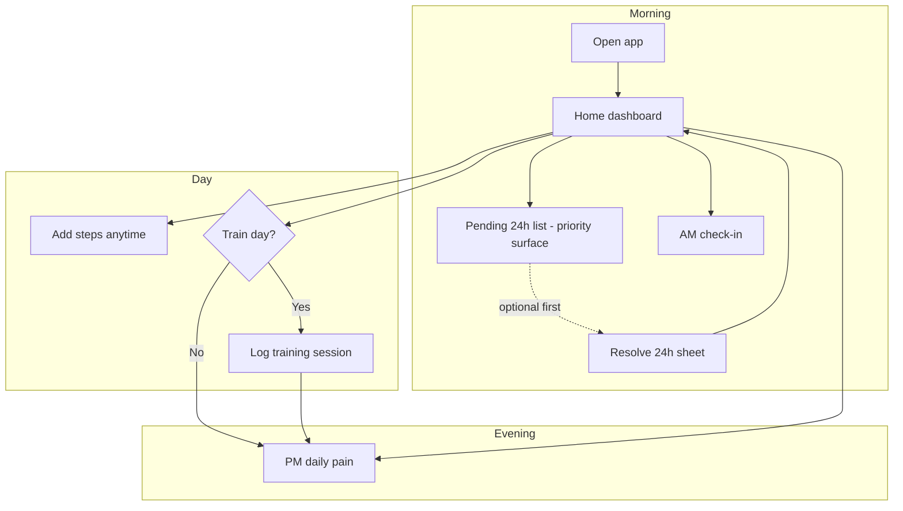
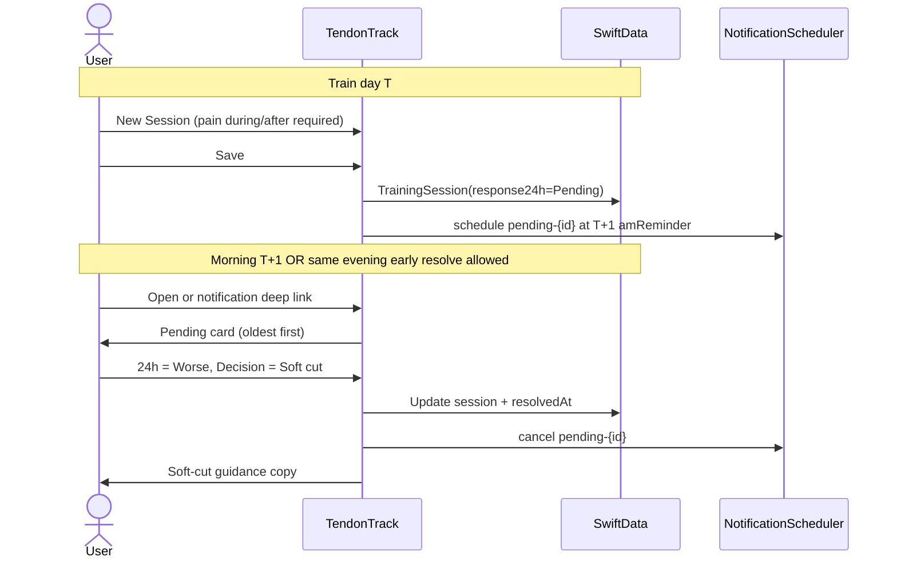
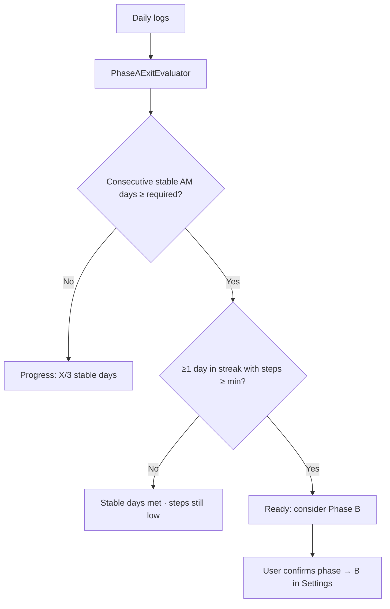
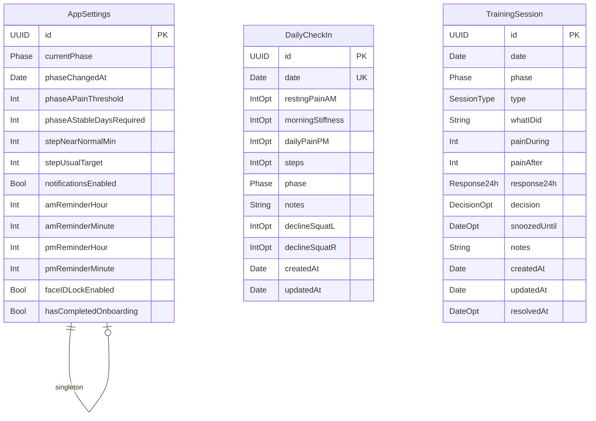
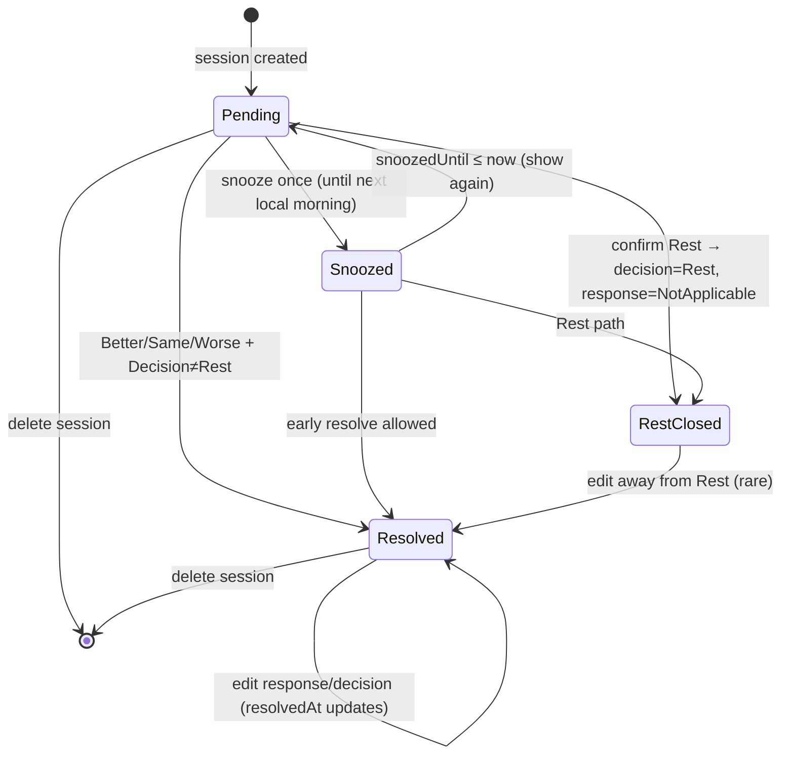
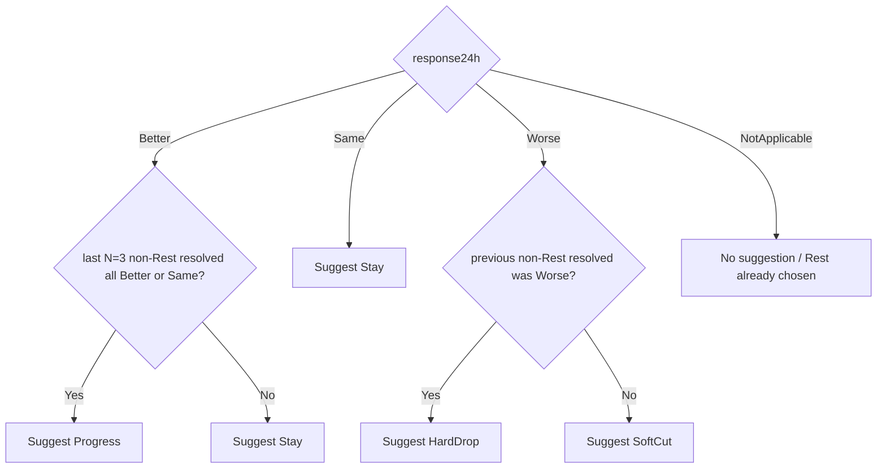
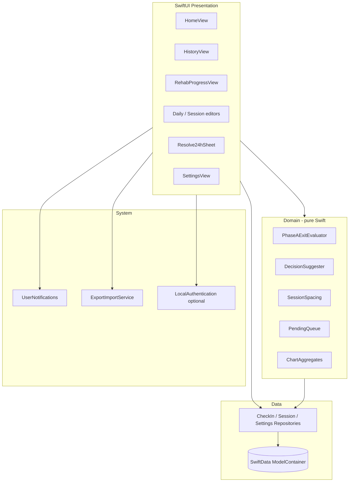
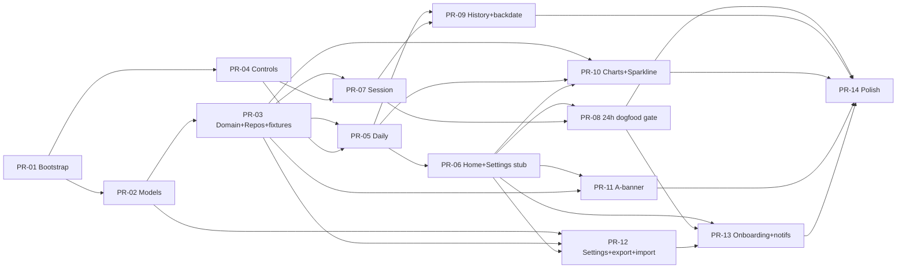

# TendonTrack — Personal iOS App for Patellar Tendinopathy Rehab Logging

| Field | Value |
|-------|--------|
| **Document** | Product & Technical Design |
| **Product** | TendonTrack (working name; alt: KneeLog) |
| **Author** | TBD (Adi + engineering) |
| **Date** | 2026-07-20 |
| **Status** | Draft → Implementation-Ready (post-review revision) |
| **Audience** | Senior engineers implementing a greenfield SwiftUI app |
| **Protocol SOT** | Notion hub: [Patellar Tendinopathy (Jumper’s Knee)](https://app.notion.com/p/3a3dd0480ada81d6addae1fb09b03051) |
| **Protocol copy revision** | `PhaseRulesCopy.protocolRevision = "2026-07-20"` |

---

## Overview

Adi is self-managing bilateral patellar tendinopathy (onset October 2024, confirmed by clinical PT + X-ray). The **rehab protocol** (phases A–E, soft cut vs hard drop, advance/fallback gates) lives correctly in Notion. Daily **logging** was tried in Notion databases (combined session/daily log, then split Daily check-in + Training log) and failed the mobile UX bar: too many taps, template duplication, unresolved 24h responses, and no visual progress.

**TendonTrack** is a personal, offline-first iPhone app whose only job is elegant, sub-60-second daily check-ins and fast session logs with a **priority-surfaced** next-morning 24h response workflow (persistent until resolved; not a hard gate on other actions). It encodes pain-guided dosing rules as *suggestions* and *progress banners*, not as medical automation. Notion remains the protocol brain; the app is the daily diary and adherence engine.

**v1 stack:** SwiftUI + SwiftData (local only). No accounts, backend, social, AI, or wearables. Distribution: Xcode sideload / personal device (TestFlight optional). iCloud sync and AM Widget are post-v1. Backup = **JSON export + JSON import** (replace or merge).

---

## Background & Motivation

### Clinical context (as of 2026-07-20)

- **Phase:** A (late) — flare de-load
- **Pain:** ~2/10 overall
- **Steps:** weekend ~4.2k vs usual ~7.5k
- **Next gate:** 3 stable days ≤2/10 **and** at least one near-normal walking day (~6–8k) → Phase B isometrics
- **Goal:** tennis when capacity allows
- **Gym tools:** leg press, knee extension, bands, decline board
- **Bilateral:** sides flip; single global AM/PM pain + optional L/R decline squat scores (KD-28)

### Core clinical model

Progressive tendon loading over months + pain-guided dosing:

- Mild pain *during* load is OK if **next morning is not worse**
- Flares → protect, then rebuild
- Never skip phases to tennis
- Hard knee sessions ≥48h apart
- Change one variable at a time

### Why not existing tools

| Approach tried / considered | Gap |
|----------------------------|-----|
| Notion Daily check-in + Training log | Mobile UX friction; template clone; Pending never closed; no charts |
| Bearable | Generic symptom tracker; no phase/24h/decision model |
| Hevy + Bearable | Split apps; no rehab decision workflow |
| Day One / Streaks / Habitify | Journals/habits, not load–response loops |
| Tally → Sheet / Shortcuts | Brittle; no product UX; high maintenance |
| PT home-exercise / niggle apps | Exercise libraries or generic injury notes; **no soft-cut / hard-drop / 24h load–response decision model** |
| Custom iOS | **Chosen** — full control over domain model + delightful daily path |

### Pain points to eliminate

1. Opening Notion, finding the right DB, duplicating TEMPLATE, filling fields on a tiny form
2. Leaving `24h response = Pending` forever
3. No glanceable “am I exiting Phase A?” progress
4. No sparkline of AM pain / steps over 7–28 days
5. Cognitive load of remembering soft cut vs hard drop rules mid-session

---

## Goals & Non-Goals

### Goals (v1)

1. Daily check-in path completable in **&lt;60 seconds** (AM or PM partial saves OK)
2. Training session log completable in **&lt;90 seconds** post-workout
3. **Priority-surface** pending 24h responses until resolved (Home queue + optional notification; **not** a hard gate on AM/PM/session logging)
4. Encode phase rules as **UI guidance** (banners, suggested decisions) without auto-advancing phases without user confirm
5. Minimal **7-day and 28-day** charts for AM pain, PM pain, steps
6. **Phase A exit criteria** progress banner (primary v1 phase intelligence; other phases lighter)
7. Offline-first; data never leaves device in v1
8. Pleasant, calm, health-adjacent visual design — not a spreadsheet or Notion clone
9. Durable backup: **export and import** JSON (round-trip restore)

### Non-Goals (v1)

| Non-goal | Rationale |
|----------|-----------|
| Multi-user / accounts / auth | Personal single-device app |
| Backend / API / analytics cloud | Privacy + scope freeze |
| AI chat / coaches | Out of scope |
| Wearable / HealthKit step auto-import | Manual steps OK for v1; HealthKit is v1.x candidate |
| Full program builder / exercise library editor | Presets only; protocol lives in Notion |
| App Store distribution | Sideload/dev OK unless user opts for TestFlight |
| iCloud sync | Optional later; export/import covers wipe/restore |
| Widget / Live Activity | v1.x |
| Social, streaks gamification, badges | Distracting from clinical honesty |
| Automatic phase transitions without confirmation | User owns phase; app suggests |
| Android / web | iPhone only |
| Notion write-back sync | One-way mental model: Notion = protocol, app = diary |
| Notion bulk import | Manual backfill / app JSON only; Notion rows stay in Notion |

---

## Requirements Catalog

Priority: **P0** = must ship in v1 · **P1** = strong v1 if cheap · **P2** = post-v1 / v1.x

Acceptance criteria use testable outcomes (Given/When/Then style bullets where critical).

### Functional requirements

| ID | Priority | Requirement | Acceptance criteria |
|----|----------|-------------|---------------------|
| **REQ-FUNC-001** | P0 | Create/edit one **DailyCheckIn** per local calendar day | Given a date D, When user saves twice, Then one row exists (upsert). Cannot create two rows for D. |
| **REQ-FUNC-002** | P0 | Daily fields: Resting pain AM, Morning stiffness, Daily pain PM (each optional Int 0–10), Steps (optional Int ≥0), Phase (A–E), optional Notes | Pain values only integers 0–10 when set. Partial save OK (e.g. AM without PM). Reject out-of-range. |
| **REQ-FUNC-003** | P0 | Optional decline squat pain L and R on daily check-in | Two optional Int 0–10 fields; not required for save. |
| **REQ-FUNC-004** | P0 | Create **TrainingSession** on train days | Multiple sessions per day allowed. Fields: date, phase, type, whatIDid, painDuring, painAfter, notes. **painDuring and painAfter required (non-nil Int 0–10) on create.** |
| **REQ-FUNC-005** | P0 | Session `response24h` starts as **Pending** | On create always Pending. Enum: Pending / Better / Same / Worse / NotApplicable. |
| **REQ-FUNC-006** | P0 | Session `decision` required when leaving Pending | Enum: Stay / SoftCut / Progress / HardDrop / Rest. Resolve paths: (a) clinical resolve: response ∈ {Better,Same,Worse} + decision; (b) Rest path: decision=Rest + response24h=NotApplicable (confirm dialog). |
| **REQ-FUNC-007** | P0 | **Pending 24h queue** — priority surface, not hard gate | Overdue list: Pending with `date < today` and not actively snoozed; oldest first; badge = count. Today’s Pending: optional **“Resolve early”** on session row only (not overdue list). No permanent dismiss. Snooze max 1 until next AM reminder time; hide Snooze if already used. Rest path clears after confirm. Not a hard gate. |
| **REQ-FUNC-008** | P0 | Resolve 24h flow | User picks response + decision (or Rest path). Soft haptic + toast. **Editable later** from History/detail; re-save updates `resolvedAt` and stored values. DecisionSuggester always reads **current** stored prior resolved sessions. Early resolve same evening as session: **allowed**. On HardDrop: optional confirm sheet “Also set phase to …?” with picker of earlier phases. |
| **REQ-FUNC-009** | P0 | Current phase in AppSettings; defaulted onto new entries | Changing phase updates default for future entries; does not rewrite history. On change, set `phaseChangedAt = now` (start-of-day local optional; store Date). |
| **REQ-FUNC-010** | P0 | Phase A exit progress (AND logic) | Banner only if currentPhase==A. `stableDaysCount` / `phaseAStableDaysRequired` (default **3**). Ready iff stableDaysCount ≥ required **AND** ≥1 day in that stable streak has steps ≥ stepNearNormalMin (default 6000). Algorithm: § Phase A exit evaluator. Missing calendar day breaks streak. Nil AM on a row = not stable. |
| **REQ-FUNC-011** | P0 | Soft cut / hard drop guidance copy | Show short rule hint **whenever** decision saved as SoftCut or HardDrop (including user override), not only when response is Worse. Optional static footnote on session detail. Non-blocking. |
| **REQ-FUNC-012** | P0 | ≥48h hard session spacing hint | If last hard session &lt;48h ago and new session type is Isometrics/HSR/EnergyStorage/Tennis, show non-blocking warning before/on save. |
| **REQ-FUNC-013** | P1 | Exercise/session **presets** by phase | Chips fill `whatIDid` + `type`; text remains editable. |
| **REQ-FUNC-014** | P0 | History list: daily + sessions chronological | Filter Daily / Session / All. Tap to edit. |
| **REQ-FUNC-014b** | P0 | **Backdate** daily check-in or session | From History: “Log past day” with date picker **≤ today** (local). Uniqueness by date still holds. Home CTAs remain **today-only**. Evaluators use stored `date`, ignore `createdAt`. |
| **REQ-FUNC-015** | P0 | Charts: 7-day and 28-day for AM pain, PM pain, steps | Empty days = gaps. Shared `SparklineView` / chart builders. |
| **REQ-FUNC-016** | P1 | Stable-day counter | Consecutive days AM ≤ phaseAPainThreshold. Shown on Home and/or Progress tab. |
| **REQ-FUNC-017** | P1 | Clean session counter for Phase B stretch | Count sessions where `date ≥ settings.phaseChangedAt` AND `phase == B` AND `response24h` ∈ {Better, Same}. Requires `phaseChangedAt` (KD-20). |
| **REQ-FUNC-018** | P0 | Local notifications (opt-in) | AM + optional PM. Pending: id `pending-{sessionId}`; fire next morning after `session.date` at AM reminder **only if fireAt &gt; now** (backdated → no schedule, queue only). On snooze: cancel + reschedule at `snoozedUntil`. Cancel on resolve/Rest/delete. Deny-permission: fully usable. Deep link `tendontrack://resolve?sessionId=` → Resolve24hSheet. |
| **REQ-FUNC-019** | P2 | HealthKit steps read | Import today’s steps into form; user confirms. |
| **REQ-FUNC-020** | P2 | iCloud SwiftData sync | Same Apple ID multi-device. |
| **REQ-FUNC-021** | P2 | Home Screen Widget for AM log | Tap opens AM check-in deep link. |
| **REQ-FUNC-022** | P0 | **Export + Import JSON** | Export via share sheet. Import: **Replace** (S8 restore) or **Merge** per KD-31: daily match on **local calendar date** (keep local id, imported scalars win); sessions match on **UUID** (update or insert). Acceptance: export → wipe → import replace → counts match. Merge date-collision test. Unknown `schemaVersion` → error, no corrupt write. Pending after import: schedule notifs only if fire &gt; now. |
| **REQ-FUNC-023** | P0 | Delete entry with confirm | Swipe or edit-screen delete; confirmation alert. Deleting session cancels its pending notification. |
| **REQ-FUNC-024** | P1 | Suggested decision from 24h | Per DecisionSuggester (KD-18). User can always override. |
| **REQ-FUNC-025** | P0 | Onboarding (first launch) | 3–4 screens: purpose, 24h model, phase picker, notifications. **Skippable.** On skip or complete: `hasCompletedOnboarding = true`. Defaults: see AppSettings default table. |
| **REQ-FUNC-026** | P1 | Optional Face ID / device auth app lock | Settings toggle default off. When on, require biometrics/passcode on foreground after background. |
| **REQ-FUNC-027** | P1 | `#if DEBUG` seed menu in Settings | Seed sample week of check-ins + one pending session; reset onboarding flag. Not in Release. |

### UX requirements

| ID | Priority | Requirement | Acceptance criteria |
|----|----------|-------------|---------------------|
| **REQ-UX-001** | P0 | Daily path &lt;60s for AM-only or PM-only | Path: Home → “Log morning” → set AM pain + stiffness → Save. Self-time ≤60s on device. Large 0–10 control. |
| **REQ-UX-002** | P0 | Session path fast post-gym | Preset → pain during/after → Save ≤90s without notes. |
| **REQ-UX-003** | P0 | Pending 24h priority until resolved | Persistent Home section (oldest-first list); optional notification; tab badge = pending count. **Not** a full-screen blocker. |
| **REQ-UX-004** | P0 | Visual progress first-class | Home: phase chip, A-exit banner (if A), pending count, mini 7-day AM sparkline (after Sparkline ships). |
| **REQ-UX-005** | P0 | Not a spreadsheet | Cards, dials, chips, sparklines as primary UI. |
| **REQ-UX-006** | P0 | Calm health aesthetic | SF Pro, Dynamic Type, semantic colors, dark mode. |
| **REQ-UX-007** | P0 | Haptics on meaningful saves | Light on check-in save; success on 24h resolve. |
| **REQ-UX-008** | P1 | Partial day state on Home | “AM done · PM missing · Steps missing” for today. |
| **REQ-UX-009** | P0 | One-thumb reachable primary CTAs | Primary actions bottom-weighted. |
| **REQ-UX-010** | P1 | Empty states with clear CTA | No data → “Log this morning’s pain”, not blank charts. |

### Non-functional requirements

| ID | Priority | Requirement | Acceptance criteria |
|----|----------|-------------|---------------------|
| **REQ-NFR-001** | P0 | Offline-first; zero network required | Airplane mode: full core flows including export file share locally. |
| **REQ-NFR-002** | P0 | Cold start to interactive Home &lt;1s on recent iPhone | No splash spinner after first install. |
| **REQ-NFR-003** | P0 | Data local only (v1); no telemetry | No analytics SDK; no crash reporter uploading PII. |
| **REQ-NFR-004** | P0 | **Minimum iOS 17.0** | Deployment target 17.0 in project + README (KD-27). |
| **REQ-NFR-005** | P0 | Accessibility: VoiceOver on pain controls; Dynamic Type | Audit main flows with VoiceOver. |
| **REQ-NFR-006** | P0 | Data durability | SwiftData on device; export+import round-trip (REQ-FUNC-022). |
| **REQ-NFR-007** | P0 | Privacy: health-adjacent data stays on device | No network upload of logs. |
| **REQ-NFR-008** | P1 | Unit-test domain rules ≥80% on evaluators/suggester | Runnable in Xcode; PR-03 includes fixture vectors. |

---

## User Journeys / Flows

### Primary personas

- **Adi (sole user):** rehabbing bilaterally; logs AM pain daily; trains 0–3×/week depending on phase; decides soft cut / hard drop from 24h response.

### Journey map (v1)

Pending is a **priority surface**, not a required first step:



### Flow: Daily check-in (AM)

```mermaid
sequenceDiagram
  actor U as User
  participant H as HomeView
  participant F as DailyCheckInForm
  participant S as SwiftData
  U->>H: Open app
  H->>H: Load today DailyCheckIn or empty
  H->>H: Show Pending 24h list if any (non-blocking)
  U->>F: Tap Log AM (allowed even if pending exists)
  F->>U: Pain dial 0–10, stiffness 0–10
  U->>F: Save
  F->>S: Upsert DailyCheckIn(date=today)
  F->>H: Haptic + return; update A-exit banner
```

### Flow: Training + 24h resolve (next morning)



### Flow: Phase A exit evaluation (advisory, AND)



---

## Information Architecture & Screen List

### Navigation

**Tab bar (3 tabs)** — simple, thumb-friendly:

| Tab | Screen type | Purpose |
|-----|-------------|---------|
| **Today** | `HomeView` | Dashboard, pending 24h, today’s checklist, primary CTAs |
| **Log** | `HistoryView` | Chronological daily + sessions; backdate entry |
| **Progress** | `RehabProgressView` | 7/28 day charts, stable-day counts, phase exit |

> **Naming:** Feature screen is `RehabProgressView` (not SwiftUI’s `ProgressView`). Tab label remains “Progress”.

Secondary (pushed / sheets):

| Screen | Presentation | Purpose |
|--------|--------------|---------|
| `DailyCheckInEditor` | Sheet or push | Create/edit daily (today or backdated) |
| `SessionEditor` | Sheet or push | Create/edit session |
| `Resolve24hSheet` | Modal sheet | 24h + decision (or Rest path) |
| `HardDropPhaseSheet` | Nested confirm | Optional “Also set phase to X?” |
| `SettingsView` | Push from Home gear | Phase, thresholds, notifications, export/import, about, DEBUG seed |
| `OnboardingView` | Full screen first launch | Education + phase + permissions |
| `PhaseGuideView` | Push from Settings / banner | Read-only condensed rules + protocolRevision footer |

### Home (Today) layout (top → bottom)

1. **Header:** Phase chip (A–E) + date + gear → Settings
2. **Pending 24h** list (if any) — **overdue/priority queue only** (`session.date < startOfToday`, not actively snoozed); oldest first; badge on tab
3. **Today checklist:** AM · PM · Steps · today’s session row(s)
   - If a **today** session is still `response24h == pending`: show compact **“Resolve early (optional)”** CTA on that session row (Home and/or Log). Does **not** appear in the overdue queue above. Early resolve is discoverable but not required.
4. **Primary CTAs:** Log morning / Log session / Log evening (today only)
5. **Phase A exit banner** (only if current phase == A)
6. **7-day AM pain sparkline** (mini; depends on shared Sparkline from PR-10)
7. Soft tip of the day (rotating rule snippet) — P1

### Screen inventory (v1)

```
TendonTrack/
├── Today (HomeView)
├── Log (HistoryView)
│   ├── DailyCheckInEditor (incl. backdate)
│   └── SessionEditor
├── Progress (RehabProgressView)
├── Resolve24hSheet
├── HardDropPhaseSheet
├── SettingsView
│   ├── PhaseGuideView
│   ├── Export / Import
│   └── DEBUG seed (DEBUG only)
└── OnboardingView
```

---

## Data Model (SwiftData)

### Entity relationship



> `IntOpt` / `DateOpt` in ER = optional (`Int?` / `Date?`) for partial daily saves and unresolved sessions. Session `painDuring` / `painAfter` are **required** at create (non-optional in model after create validation).

### Enumerations

```swift
enum Phase: String, Codable, CaseIterable, Identifiable {
    case aFlareDeload = "A"
    case bIsometrics = "B"
    case cHeavySlowResistance = "C"
    case dEnergyStorage = "D"
    case eReturnToSport = "E"

    var displayName: String { /* full Notion labels */ }
    var sortOrder: Int { /* 0...4 */ }

    var earlierPhases: [Phase] {
        Phase.allCases.filter { $0.sortOrder < sortOrder }
    }
}

enum SessionType: String, Codable, CaseIterable {
    case isometrics
    case hsrStrength
    case energyStorage
    case tennisSport
    case other
}

enum Response24h: String, Codable, CaseIterable {
    case pending
    case better
    case same
    case worse
    /// Used with Decision.rest when closing without clinical 24h judgment
    case notApplicable
}

enum Decision: String, Codable, CaseIterable {
    case stay
    case softCut
    case progress
    case hardDrop
    case rest
}
```

### SwiftData models (sketch)

```swift
@Model
final class DailyCheckIn {
    @Attribute(.unique) var id: UUID
    /// Start-of-day in local calendar, unique.
    @Attribute(.unique) var date: Date
    var restingPainAM: Int?          // nil = not logged yet; 0...10 when set
    var morningStiffness: Int?
    var dailyPainPM: Int?
    var steps: Int?
    var phase: String                // Phase.rawValue
    var notes: String
    var declineSquatL: Int?
    var declineSquatR: Int?
    var createdAt: Date
    var updatedAt: Date
}

@Model
final class TrainingSession {
    @Attribute(.unique) var id: UUID
    var date: Date                   // session calendar day (local)
    var phase: String
    var type: String
    var whatIDid: String
    var painDuring: Int              // required 0...10 on create
    var painAfter: Int               // required 0...10 on create
    var response24h: String          // default pending
    var decision: String?            // nil while pending
    /// Set once on snooze to next AM reminder clock; retained after expiry
    /// (max-1 enforcement). Nilled only on resolve / Rest / delete.
    var snoozedUntil: Date?
    var notes: String
    var createdAt: Date
    var updatedAt: Date
    var resolvedAt: Date?
}

@Model
final class AppSettings {
    @Attribute(.unique) var id: UUID
    var currentPhase: String
    var phaseChangedAt: Date         // updated when currentPhase changes
    var phaseAPainThreshold: Int     // default 2
    var phaseAStableDaysRequired: Int // default 3
    var stepNearNormalMin: Int       // default 6000
    var stepUsualTarget: Int         // default 7500
    var notificationsEnabled: Bool
    var amReminderHour: Int          // default 8
    var amReminderMinute: Int        // default 0
    var pmReminderHour: Int          // default 20
    var pmReminderMinute: Int        // default 0
    var faceIDLockEnabled: Bool      // default false
    var hasCompletedOnboarding: Bool
}
```

### AppSettings defaults (first launch / seed)

| Field | Default |
|-------|---------|
| `currentPhase` | `A` |
| `phaseChangedAt` | `Date()` at seed |
| `phaseAPainThreshold` | `2` |
| `phaseAStableDaysRequired` | `3` |
| `stepNearNormalMin` | `6000` |
| `stepUsualTarget` | `7500` |
| `notificationsEnabled` | `false` until user grants |
| `amReminderHour` / `Minute` | `8` / `0` |
| `pmReminderHour` / `Minute` | `20` / `0` |
| `faceIDLockEnabled` | `false` |
| `hasCompletedOnboarding` | `false` until complete **or skip** → then `true` |

### Uniqueness & calendar rules

- **Local calendar day** is the unit of logging (device timezone).
- `DailyCheckIn.date` stored as start-of-day local; unique.
- `TrainingSession.date` = day performed (not resolve day). Backdate allowed if `date ≤ today`.
- Resolving 24h (or Rest) does not change `date`; sets `resolvedAt`, `response24h`, `decision`; **nils `snoozedUntil`**.
- Evaluators use stored `date` / pain fields; **`createdAt` never affects streaks**.

### Migration strategy (v1)

- Greenfield: schema v1 only.
- Future: SwiftData versioned migrations when adding HealthKit fields or iCloud.
- Export JSON: `"schemaVersion": 1`.

### Mapping from Notion databases

| Notion Daily check-in | TendonTrack DailyCheckIn |
|----------------------|--------------------------|
| Date | date |
| Resting pain AM | restingPainAM |
| Morning stiffness | morningStiffness |
| Daily pain PM | dailyPainPM |
| Steps | steps |
| Phase | phase |
| Notes | notes |
| *(optional decline in notes)* | declineSquatL / R (first-class) |
| Name (title) | not needed (derived from date) |

| Notion Training log | TendonTrack TrainingSession |
|--------------------|----------------------------|
| Date | date |
| Phase | phase |
| Type | type |
| What I did | whatIDid |
| Pain during | painDuring |
| Pain after | painAfter |
| 24h response | response24h (+ NotApplicable for Rest path) |
| Decision | decision |
| Notes | notes |
| Name | not needed |

---

## Business Rules / Domain Logic

Domain logic lives in pure Swift structs (testable without UI): `PhaseAExitEvaluator`, `DecisionSuggester`, `SessionSpacing`, `PendingQueue`.

### Global rules (all phases)

| Rule ID | Rule | App behavior |
|---------|------|--------------|
| **BR-001** | During exercise prefer ≤3–4/10; stop if sharp or &gt;5 | If painDuring ≥ 5, amber/red warning on save (non-blocking). |
| **BR-002** | Next morning not worse → keep or progress | Informs DecisionSuggester (Better/Same → Stay; Progress only after N clean). |
| **BR-003** | Next morning worse → **soft cut first** | Suggest SoftCut on first Worse. |
| **BR-004** | Two Worse 24h in a row (non-Rest) → hard drop | Suggest HardDrop only on second consecutive Worse. Absolute AM ≥ 3 alone does **not** force HardDrop. |
| **BR-005** | Hard knee sessions ≥48h apart | Soft warning if &lt;48h since last hard type. |
| **BR-006** | Change one variable at a time | PhaseGuide copy only. |
| **BR-007** | Same pain at higher load/steps/tennis = progress | Copy only. |
| **BR-008** | Never skip phases to tennis | Jumping A→E (sortOrder delta &gt; 1) shows confirm. |
| **BR-009** | Soft cut = same phase, less next session | Hint whenever decision is SoftCut. |
| **BR-010** | Hard drop = earlier phase | On HardDrop: optional sheet “Also set phase to X?” with picker of earlier phases. |

---

### 24h Pending State Machine (normative)



#### Policies (KD-16)

| Topic | Policy |
|-------|--------|
| Hard gate? | **No.** Priority UI only. AM/PM/session always available. |
| Permanent dismiss | **No.** |
| Snooze end time | On snooze action: set `snoozedUntil` = **next local calendar morning at `amReminderHour:amReminderMinute`** (not midnight). Example: snooze Mon 21:00 with AM reminder 08:00 → `snoozedUntil` = Tue 08:00 local. After that instant, card is due again in the priority queue (if `date < today`) or remains early-resolve only (if still today—rare). |
| Snooze max / field lifetime | **Max 1 snooze** per session. Hide Snooze control if `snoozedUntil != nil` (already used). **Do not nil `snoozedUntil` on expiry** — keep the timestamp so `snoozeOnce` stays idempotent-fail. Nil `snoozedUntil` **only** on resolve, Rest, or delete. |
| Snooze re-notification | On snooze: **cancel** `pending-{id}` and **schedule one** replacement notification for `snoozedUntil` (same datetime as re-show). See KD-25. |
| Rest path | Confirm: “Close without 24h judgment?” → `decision = rest`, `response24h = notApplicable`, `resolvedAt = now`. Clears pending; nils `snoozedUntil`. |
| Queue order | Oldest `session.date` first, then `createdAt`. |
| Multiple pending | Full scrollable list + badge count. **No bulk resolve** in v1. |
| Early resolve | **Allowed** same calendar day as session. Surface: compact **“Resolve early (optional)”** on today’s session card (Home checklist / Log)—not in overdue list. |
| Still Pending if `session.date == today`? | **Not** in `priorityPending` / overdue list. Optional early-resolve CTA only. Overdue queue = `date < startOfToday` AND `response24h == pending` AND (`snoozedUntil == nil` OR `snoozedUntil <= now`). |
| Edit after resolve | **Allowed.** Updates fields + `resolvedAt = now`. Suggester uses **session-date chronology** of priors (KD-18), not resolve order. |
| Re-open to Pending | Setting back to Pending clears decision and `resolvedAt`; may reschedule notification if fire date is still in the future. |
| Notifications (create) | Schedule `pending-{uuid}` only if **computed fire datetime &gt; now**. Fire = next local morning **after** `session.date` at AM reminder time. **Backdated / past fire:** do **not** schedule; rely on Home queue + badge. On import of Pending sessions: same rule (future fires only). Always recompute queue from data. |
| Notifications (cancel) | Cancel on resolve, Rest, or delete. |
| Deep link | URL: `tendontrack://resolve?sessionId={uuid}` (query form preferred; path form `tendontrack://resolve/{uuid}` also accepted). Opens `Resolve24hSheet`. Scheme registered in Info.plist (`CFBundleURLTypes`). |

#### Home pending card actions

- **Resolve** → sheet
- **Snooze** (only if `snoozedUntil == nil`) → set snoozedUntil to next AM reminder; cancel + reschedule notification; hide until due
- **Rest** → confirm → RestClosed
- No “X dismiss forever”

---

### Soft cut vs hard drop (DecisionSuggester)



#### DecisionSuggester contract (KD-18)

**Normative prior ordering (session chronology only — not resolve time):**

1. Consider prior sessions with `id != current`, `response24h ∈ {better, same, worse}` (exclude `pending`, `notApplicable`, and any with `decision == rest`).
2. Sort by **`session.date` descending**, then **`createdAt` descending** (tiebreak for same-day multi-session).
3. **`resolvedAt` must never define “in a row.”** Clinical “two Worse in a row” = two consecutive **load days / training sessions** by performance date, regardless of the order the user closed Pending cards.

```swift
struct DecisionSuggester {
    /// - recentResolvedNonRest: prior non-Rest clinical responses only,
    ///   **sorted session.date desc, createdAt desc** (exclude session being resolved).
    /// - cleanN: default 3
    static func suggest(
        response: Response24h,
        recentResolvedNonRest: [Response24h], // Better/Same/Worse only, session chronology
        currentPhase: Phase,
        cleanN: Int = 3
    ) -> Decision? {
        switch response {
        case .pending, .notApplicable:
            return nil
        case .same:
            return .stay
        case .better:
            let streak = recentResolvedNonRest.prefix(cleanN)
            let allClean = streak.count == cleanN
                && streak.allSatisfy { $0 == .better || $0 == .same }
            return allClean ? .progress : .stay
        case .worse:
            // "Previous training session" = first in session-chronology list
            if recentResolvedNonRest.first == .worse {
                return .hardDrop
            }
            return .softCut
        }
    }
}
```

**Implementer rule (simplest, testable):**

- Build list L = all **resolved** non-Rest sessions excluding S, sorted `date ASC, createdAt ASC`.
- `immediatePredecessor` = last session in L with `(date, createdAt) < (S.date, S.createdAt)`.
- Two-Worse: if current response is Worse and `immediatePredecessor.response24h == worse` → **HardDrop**, else **SoftCut**.
- Clean-N Progress: among sessions in L immediately preceding S (up to N), all Better/Same → suggest Progress on Better.

**Test vector (mandatory PR-03):**

| Step | Action | Expected suggestion |
|------|--------|---------------------|
| 1 | Create Mon + Wed sessions (both Pending) | — |
| 2 | Resolve **Wed** = Worse first | **SoftCut** (Mon still Pending → not a resolved predecessor) |
| 3 | Resolve **Mon** = Worse | **SoftCut** (no resolved predecessor before Mon) |
| 4 | Create **Fri**; resolve Fri = Worse | **HardDrop** (immediate resolved predecessor by date is Wed = Worse) |

Unresolved older sessions never count as predecessors. Resolve order of Pending cards cannot invent a false HardDrop on the chronologically first Worse.

**Explicit non-rules:**

- Absolute AM pain ≥ 3 does **not** by itself suggest HardDrop (soft cut first).
- “Rising” is **not** a HardDrop trigger in v1 code.
- **`resolvedAt` order never drives HardDrop/SoftCut.**
- Rest / NotApplicable sessions **do not** count toward two-Worse or clean-N streaks.

**HardDrop UI (REQ-FUNC-008):** After choosing HardDrop, present optional sheet: “Also set current phase to …?” default suggestion = previous phase (B→A, C→B, etc.; E→C preferred default). User can pick any earlier phase or “Don’t change phase”. On confirm phase change: update `currentPhase` + `phaseChangedAt`.

**Guidance copy (REQ-FUNC-011):** Whenever final decision is SoftCut or HardDrop (suggester or override), show one-liner (SoftCut: −20–30% load / shorter holds; HardDrop: earlier phase meaning).

---

### Phase ladder

| Phase | Do | Advance when | Soft cut | Hard drop |
|-------|-----|--------------|----------|-----------|
| **A** Flare de-load | Relative rest; easy bike if pain-free; no heavy/impact/tennis | ≤2/10 for **3** consecutive stable AM days **and** ≥1 of those days steps ≥6k | Less walking | Medical if red flags |
| **B** Isometrics | Wall sit / Spanish / ext hold; 3–4×20–30s → 45s; 2×/wk; ≥48h | 4–6+ clean sessions; last 3 24h OK; steps ~7.5k; resting low | Shorter/easier holds | → A |
| **C** HSR | Leg press + extension 2–3×/wk, tempo 3-1-3; months | ~6–8+ wks capacity↑, stable life | −20–30% load / drop set | → B or A |
| **D** Energy storage | Low-volume landings/plyos; keep some C | Weeks clean 24h on speed + stable HSR | −50% plyo volume | → C or A |
| **E** Return to sport | Tennis ladder; keep 1–2 HSR days | Desired tennis, stable 24h | Fewer tennis minutes | → C or A |

### Phase A exit evaluator (v1 primary, AND only)

```swift
struct PhaseAExitStatus: Equatable {
    var stableDaysCount: Int
    var stableDaysRequired: Int        // default 3
    var nearNormalStepDaysInStreak: Int
    var needsNearNormalSteps: Bool     // nearNormalStepDaysInStreak == 0
    var isReadyToAdvance: Bool         // stableDaysCount ≥ required && !needsNearNormalSteps
    var message: String
}

enum PhaseAExitEvaluator {
    /// Normative algorithm (KD-17):
    /// 1. Build map of local start-of-day → DailyCheckIn for all provided check-ins.
    /// 2. Anchor: if today has a check-in row, start from today; else start from yesterday.
    /// 3. Walk backward day-by-day:
    ///    - Missing entire day (no row) → streak breaks (stop).
    ///    - Row exists but restingPainAM == nil → not stable, streak breaks (stop).
    ///    - restingPainAM > phaseAPainThreshold → streak breaks (stop).
    ///    - restingPainAM ≤ threshold → stableDaysCount += 1;
    ///      if steps != nil && steps >= stepNearNormalMin → nearNormalStepDaysInStreak += 1.
    /// 4. isReadyToAdvance = stableDaysCount >= phaseAStableDaysRequired
    ///      && nearNormalStepDaysInStreak >= 1.
    /// 5. Backfilled/past dates participate fully (use date field, not createdAt).
    static func evaluate(
        checkIns: [DailyCheckIn],
        settings: AppSettings,
        today: Date,
        calendar: Calendar
    ) -> PhaseAExitStatus
}
```

#### Phase A fixture table (mandatory PR-03 test vectors)

Thresholds: painMax=2, required=3, stepMin=6000. `—` = no check-in row. `nil` = row exists, AM not logged.

| # | Day series (oldest → newest = today) AM / steps | stableDaysCount | nearNormal in streak | Ready? | Notes |
|---|--------------------------------------------------|-----------------|----------------------|--------|-------|
| F1 | (empty) | 0 | 0 | No | No data |
| F2 | 2/5000, 2/5000 | 2 | 0 | No | 2/3; steps low |
| F3 | 2/5000, 2/5000, 2/7000 | 3 | 1 | **Yes** | Classic ready |
| F4 | 2/7000, 2/7000, 2/7000 | 3 | 3 | **Yes** | Ready |
| F5 | 2/7000, —, 2/7000 | 1 | 1 | No | Gap breaks streak |
| F6 | 2/7000, nil/7000, 2/7000 | 1 | 1 | No | Nil AM breaks |
| F7 | 2/7000, 3/7000, 2/7000 | 1 | 1 | No | Pain 3 breaks |
| F8 | 1/8000, 2/4000, 2/4000 | 3 | 1 | **Yes** | Near-normal on older day **in streak** |
| F9 | 2/7000, 2/7000, 2/4000 (today no row; “today” anchor = yesterday) | evaluate from yesterday: if series ends at yesterday with 3 stable… | | | Anchor rule: if today has no row, walk from yesterday |

F9 detail: Given check-ins only for D-3,D-2,D-1 (yesterday) all AM=2 and one ≥6000 steps, and **today has no row**, anchor=yesterday → stableDaysCount=3 → Ready. Opening app mid-day without logging does not erase yesterday’s streak.

Banner copy examples:

- Progress: `Stable mornings: 2/3 · Need a ~6k+ step day in the streak`
- Steps gap: `3/3 stable · steps still low — aim ~6–8k when pain stays ≤2`
- Ready: `Exit criteria looking good — switch to Phase B when ready (Settings)`

### Phase B clean-session stretch (REQ-FUNC-017)

```swift
// stretch sessions: date >= settings.phaseChangedAt && phase == "B"
// clean: response24h in {better, same}
```

When user sets phase to B (or re-enters B), `phaseChangedAt` resets — prior B periods do not count. Good enough for P1 counter.

### Session spacing

```swift
enum HardSession {
    static func isHard(_ type: SessionType) -> Bool {
        switch type {
        case .isometrics, .hsrStrength, .energyStorage, .tennisSport: return true
        case .other: return false
        }
    }

    static func hoursSinceLastHard(sessions: [TrainingSession], now: Date) -> Double?
}
```

### Red flags (display only)

From Notion Plan — show in PhaseGuide and if AM pain ≥ 5:

- Resting pain 5+
- Not improving after 7–10 days de-load
- Swelling, locking, instability, sharp joint pain → see PT/doctor

App does **not** diagnose; static educational copy only.

### What the app does *not* auto-do

- Does not auto-change `currentPhase` on HardDrop without confirmation sheet
- Does not block logging tennis in Phase A (warns only)
- Does not compute load percentages (free text in whatIDid only)
- Does not hard-block other logging while Pending exists

---

## Proposed Design — Architecture

### High-level



### Project structure (Xcode)

```
TendonTrack/
├── App/
│   ├── TendonTrackApp.swift
│   ├── AppContainer.swift
│   └── DeepLinkHandler.swift       // tendontrack://resolve?sessionId=
├── Models/
│   ├── DailyCheckIn.swift
│   ├── TrainingSession.swift
│   ├── AppSettings.swift
│   └── Enums.swift
├── Domain/
│   ├── PhaseAExitEvaluator.swift
│   ├── DecisionSuggester.swift
│   ├── SessionSpacing.swift
│   ├── PendingQueue.swift
│   ├── ChartAggregates.swift
│   └── PhaseRulesCopy.swift        // protocolRevision = "2026-07-20"
├── Data/
│   ├── Repositories/
│   │   ├── DailyCheckInRepository.swift
│   │   ├── TrainingSessionRepository.swift
│   │   └── SettingsRepository.swift
│   └── PreviewSampleData.swift
├── Features/
│   ├── Home/
│   │   ├── HomeView.swift
│   │   ├── HomeViewModel.swift
│   │   ├── TodayChecklistView.swift
│   │   └── Pending24hCard.swift
│   ├── Daily/
│   │   └── DailyCheckInEditor.swift
│   ├── Session/
│   │   ├── SessionEditor.swift
│   │   ├── Resolve24hSheet.swift
│   │   ├── HardDropPhaseSheet.swift
│   │   └── SessionPresets.swift
│   ├── History/
│   │   └── HistoryView.swift
│   ├── Progress/
│   │   ├── RehabProgressView.swift
│   │   └── SparklineView.swift
│   ├── Settings/
│   │   ├── SettingsView.swift
│   │   ├── PhaseGuideView.swift
│   │   └── DebugSeedView.swift     // #if DEBUG
│   └── Onboarding/
│       └── OnboardingView.swift
├── Components/
│   ├── PainScoreControl.swift
│   ├── PhaseChip.swift
│   ├── PrimaryButton.swift
│   └── EmptyStateView.swift
├── Services/
│   ├── NotificationScheduler.swift
│   └── ExportImportService.swift
├── Resources/
│   └── Assets.xcassets
└── Tests/
    ├── PhaseAExitEvaluatorTests.swift   // F1–F9 (PR-03)
    ├── DecisionSuggesterTests.swift     // session-date two-Worse (PR-03)
    ├── SessionSpacingTests.swift
    ├── PendingQueueTests.swift
    └── ExportImportTests.swift          // PR-12 only
```

### App entry

```swift
@main
struct TendonTrackApp: App {
    let container: ModelContainer

    init() {
        container = AppContainer.makeModelContainer()
    }

    var body: some Scene {
        WindowGroup {
            RootView()
                .modelContainer(container)
                .onOpenURL { url in DeepLinkHandler.handle(url) }
        }
    }
}
```

### State management approach

- **SwiftData `@Query`** for lists and Home today fetch where possible
- **Light ViewModels** (`@Observable`) for Home aggregation (pending + A-exit + checklist)
- **No TCA/Redux** in v1
- Repositories wrap `ModelContext` for test seams and uniqueness logic

### Pain score control (UX critical)

- **Recommended:** Horizontal 0–10 segment / dial with large taps (integers only)
- Always show numeric value; color shifts green→amber→red

### Charts

- **Swift Charts** for full 7/28 day on `RehabProgressView`
- Shared **`SparklineView`** used by Home mini chart and Progress
- `ChartAggregates` builds `[DayValue]` with nil gaps for missing days
- **Dependency:** Home sparkline ships with/after PR-10 (`SparklineView`); PR-06 may omit mini sparkline or show placeholder until PR-10 merges

### Notifications

| Trigger | Schedule | Identifier | Body / action |
|---------|----------|------------|---------------|
| AM reminder | Daily at amReminderHour:Minute | `am-reminder` | “Log morning pain & stiffness” |
| PM reminder | Daily at pm… | `pm-reminder` | “Log evening pain & steps” |
| Pending 24h (create) | Next local morning **after** `session.date` at AM reminder time — **only if fireAt &gt; now** | `pending-{sessionId}` | “How did your tendon respond?” → deep link |
| Pending after snooze | **Cancel** existing `pending-{id}`; schedule **one** replacement at `snoozedUntil` (next AM reminder clock) | same id | Same body / deep link |
| Backdated session | Computed fire ≤ now → **do not schedule**; Home overdue queue only | — | — |
| Import Pending | Reschedule **future** fires only | `pending-{id}` | Recompute from data |

- Request authorization in onboarding; deny path fully usable
- Reschedule AM/PM on settings change
- Cancel `pending-{id}` on resolve / Rest / delete; if re-opened to Pending, schedule only if fire &gt; now

### Deep links

| URL | Behavior |
|-----|----------|
| `tendontrack://resolve?sessionId={uuid}` | **Canonical.** Open app → `Resolve24hSheet` for session |
| `tendontrack://resolve/{uuid}` | Also accepted (path form) |
| `tendontrack://checkin/today` | Open DailyCheckInEditor for today (widget later) |

**Registration:** Add `CFBundleURLTypes` with scheme `tendontrack` in target Info.plist by **PR-08** (stub allowed in PR-01). Document in README. `DeepLinkHandler` + `.onOpenURL` parse either form.

---

## API / Interface Changes

N/A for network API. **Internal interfaces:**

### Repository protocols

```swift
protocol DailyCheckInRepositoryProtocol {
    func checkIn(on date: Date) throws -> DailyCheckIn?
    func upsert(_ draft: DailyCheckInDraft) throws -> DailyCheckIn
    func delete(id: UUID) throws
    func checkIns(from: Date, to: Date) throws -> [DailyCheckIn]
}

protocol TrainingSessionRepositoryProtocol {
    func insert(_ draft: SessionDraft) throws -> TrainingSession
    func update(_ session: TrainingSession) throws
    /// Overdue queue: response==pending AND date < startOfToday
    /// AND (snoozedUntil == nil || snoozedUntil <= now), sorted oldest date first
    func priorityPending(asOf now: Date) throws -> [TrainingSession]
    /// Today's still-Pending sessions for optional early-resolve CTA
    func todayPending(asOf now: Date) throws -> [TrainingSession]
    func resolve(id: UUID, response: Response24h, decision: Decision) throws
    /// Sets snoozedUntil = next AM reminder clock; fails if snoozedUntil already non-nil
    func snoozeOnce(id: UUID, until: Date) throws
    func sessions(from: Date, to: Date) throws -> [TrainingSession]
    /// Resolved non-Rest excluding id, for DecisionSuggester.
    /// Sort: session.date DESC, createdAt DESC (session chronology — never resolvedAt).
    func recentResolvedNonRest(excluding id: UUID, limit: Int) throws -> [TrainingSession]
    func lastHardSession(before date: Date) throws -> TrainingSession?
}

protocol NotificationSchedulerProtocol {
    /// Schedule pending-{id} only if fireAt > now; no-op if fireAt <= now (backdated sessions).
    func schedulePending24h(sessionId: UUID, fireAt: Date) throws
    /// Cancel pending-{id}, then schedule at snoozedUntil (must be > now).
    func rescheduleAfterSnooze(sessionId: UUID, fireAt: Date) throws
    func cancelPending24h(sessionId: UUID) throws
}

protocol SettingsRepositoryProtocol {
    func settings() throws -> AppSettings
    func setPhase(_ phase: Phase) throws  // also updates phaseChangedAt
}
```

### Export / import schema (v1)

```json
{
  "schemaVersion": 1,
  "exportedAt": "2026-07-20T12:00:00Z",
  "settings": {
    "currentPhase": "A",
    "phaseChangedAt": "2026-07-01T00:00:00Z",
    "phaseAPainThreshold": 2,
    "phaseAStableDaysRequired": 3,
    "stepNearNormalMin": 6000,
    "stepUsualTarget": 7500
  },
  "dailyCheckIns": [ /* id, date, fields... */ ],
  "trainingSessions": [ /* id, date, fields, response24h, decision... */ ]
}
```

**Import modes:**

1. **Replace (preferred for restore drill S8):** delete all check-ins + sessions; insert all rows from file (adopt import ids); optionally replace settings (confirm). Treat export files primarily as **backup restore** via Replace.
2. **Merge** — normative collision algorithm:

**DailyCheckIn merge (identity = local calendar `date` only):**

| Case | Action |
|------|--------|
| Import row date D matches existing local row | **Update** all scalar fields on the **existing local row**; **keep local `id`**. Imported `id` for that date is discarded (local id wins for identity). |
| Import row date D has no local row | **Insert** new row; adopt import `id` and all fields. |
| Local row exists for date not in import | **Leave unchanged** (merge does not delete). |

Rationale: unique constraint is on `date`; matching by date avoids unique violations when import id ≠ local id for the same day. Future merges that re-export will carry local ids after first merge-update.

**TrainingSession merge (identity = UUID only):**

| Case | Action |
|------|--------|
| Import `id` exists locally | **Update** all scalar fields from import (imported wins). |
| Import `id` unknown | **Insert** full row with import `id`. |
| Local session id not in import | **Leave unchanged**. |

**After merge/replace of Pending sessions:** recompute notifications — schedule only if fire datetime &gt; now; never schedule past fires (KD-25).

Acceptance: export → wipe → import **replace** → counts and field values match (S8). Merge: same-date daily with different ids updates local row without duplicate date; session id collision updates fields.

---

## Alternatives Considered

### 1. Continue Notion-only logging

| Pros | Cons |
|------|------|
| Zero build | Mobile UX already failed |
| Protocol + logs co-located | No priority 24h, weak charts, template friction |

**Rejected** for daily diary; Notion retained for protocol.

### 2. React Native / Expo app

| Pros | Cons |
|------|------|
| Shared if Android later | No Android need |
| Fast UI iteration | SwiftData/Charts/Widget path cleaner native |

**Rejected** — SwiftUI preferred.

### 3. iOS Shortcuts + Apple Notes / Numbers

| Pros | Cons |
|------|------|
| No code | Fragile; ugly; no domain guidance |

**Rejected.**

### 4. Generic habit app + spreadsheet export

| Pros | Cons |
|------|------|
| Existing apps | Cannot encode soft cut / 24h / phase exit |

**Rejected.**

### 5. Full HealthKit + CareKit research-style app

| Pros | Cons |
|------|------|
| Rich health integration | Overkill for v1; privacy surface larger |

**Deferred** to v1.x (steps import only).

### 6. Cloud-synced multi-device with backend

| Pros | Cons |
|------|------|
| Backup, multi-device | Accounts, cost, privacy, scope |

**Deferred** — local + **export/import** first; iCloud later.

### 7. PT home-exercise / injury-tracker apps

| Pros | Cons |
|------|------|
| Some have HEP programs | No 24h load–response + soft cut / hard drop decision loop; not phase-gated to this protocol |

**Rejected** for diary/decision workflow.

---

## Key Decisions

| # | Decision | Rationale |
|---|----------|-----------|
| **KD-1** | Product name **R3hab** (bundle/module may use `R3hab`; former working title TendonTrack) | User-chosen 2026-07-20; domain = rehab. |
| **KD-2** | SwiftUI + SwiftData, **iOS 17.0+**, no backend | Offline personal scope; min iOS locked for PR-01. |
| **KD-3** | Two entities: DailyCheckIn + TrainingSession | Mirrors Notion split; different cadences. |
| **KD-4** | Phase is **user-owned**; app only suggests | Clinical safety + agency. |
| **KD-5** | Pending 24h is first-class **priority surface**, not hard gate | Differentiator vs Notion without blocking adherence logging. |
| **KD-6** | Phase A exit evaluator is only deep phase intelligence in v1 | User currently in A; B counter is P1. |
| **KD-7** | Decline squat L/R optional first-class fields | Better than stuffing notes. |
| **KD-8** | Pain scores **integers 0–10 only** (v1) | Speed; half-points out of scope. Daily optional; session during/after **required**. |
| **KD-9** | Notion = protocol SOT; app static PhaseGuide + `protocolRevision` | Offline; drift controlled by version footer. |
| **KD-10** | No HealthKit in v1 | Ship logging first. |
| **KD-11** | Tab bar: Today / Log / Progress (`RehabProgressView`) | Avoid SwiftUI ProgressView name clash. |
| **KD-12** | Soft warnings, not hard blocks | Edge cases; abandon risk. |
| **KD-13** | Backup = **JSON export + import** (replace/merge) P0 | Device wipe recoverability without iCloud. |
| **KD-14** | Domain logic pure + unit tested | Rules evolve independently of UI. |
| **KD-15** | Sideload / personal distribution for v1 | No App Store tax yet. |
| **KD-16** | **24h pending policy:** overdue list oldest-first (`date < today`); no permanent dismiss; max 1 snooze; `snoozedUntil` = next calendar morning at **amReminderHour:Minute** (not midnight); do not nil `snoozedUntil` on expiry (only resolve/Rest/delete); on snooze cancel+reschedule notif at that time; Rest → NotApplicable; early resolve via optional today CTA; edit after resolve OK | Closes OQ-2; snooze/notification edge cases. |
| **KD-17** | **Phase A exit:** AND only; required=3; consecutive calendar days; missing day or nil AM breaks; near-normal steps ≥1 day **inside streak**; anchor today if logged else yesterday | Closes OQ-3; fixtures F1–F9. |
| **KD-18** | **DecisionSuggester:** Better→Stay (Progress after 3 clean non-Rest by session chronology); Same→Stay; Worse→SoftCut; HardDrop iff immediate **session-date** predecessor (then createdAt) among resolved non-Rest is Worse. Sort priors by **date/createdAt only — never resolvedAt** | Closes OQ-4; correct “two Worse in a row” under multi-pending resolve order. |
| **KD-19** | HardDrop shows optional “set phase to earlier?” sheet with picker | Closes OQ-9. |
| **KD-20** | `phaseChangedAt` on AppSettings for Phase B stretch | Makes REQ-FUNC-017 implementable. |
| **KD-21** | Reminder times stored as hour/minute Ints | Align ER + code. |
| **KD-22** | Backdating allowed from History, date ≤ today | Recover streaks / S1. |
| **KD-23** | Response24h includes `notApplicable` for Rest path | Cleaner than overloading Same. |
| **KD-24** | SoftCut/HardDrop guidance whenever that decision is saved | Including overrides. |
| **KD-25** | Notification id `pending-{sessionId}`; fire next morning after `session.date` at AM reminder; **skip schedule if fire ≤ now** (backdated); on snooze cancel + reschedule at `snoozedUntil`; cancel on resolve/Rest/delete; import reschedules future-only | Avoids dead past UNNotifications; restores nag after snooze. |
| **KD-31** | Daily merge identity = **local calendar date** (keep local id on date match); session merge identity = **UUID** | Avoids unique-date collisions; S8 prefers Replace. |
| **KD-32** | URL scheme `r3hab` with `r3hab://resolve?sessionId=` | Product name R3hab; register in Info.plist by PR-08. |
| **KD-26** | Onboarding skip sets `hasCompletedOnboarding=true`; defaults phase A + thresholds 2/3/6000/7500 | No stuck first-run. |
| **KD-27** | Minimum iOS **17.0** (recommend; user can raise if device is 18-only) | Unblocks PR-01. |
| **KD-28** | Bilateral: single AM/PM pain + optional L/R decline; notes for side nuance | Closes OQ-12; no dual-knee entity v1. |
| **KD-29** | Multiple sessions/day allowed; free text for load; no structured sets v1 | Closes OQ-5, OQ-11. |
| **KD-30** | No automated Notion import in v1 | Manual backfill / live logging. |

---

## Security & Privacy Considerations

### Threat model (personal health-adjacent data)

| Threat | Severity | Mitigation |
|--------|----------|------------|
| Device theft / loss | Medium | iOS passcode/Face ID; optional in-app Face ID lock (REQ-FUNC-026 P1) |
| iCloud device backup of app data | Low–Med | Documented; no extra cloud in v1 |
| Accidental share of export | Low | Explicit share sheet only |
| Third-party SDK exfiltration | High if present | **No analytics/ads SDKs in v1** |
| Notion API token leakage | N/A | No Notion integration |

### Data handling

- Categories: pain scores, steps, exercise notes, phase — **health-related, sensitive**
- Storage: app sandbox SwiftData
- Network: none in v1
- Logging: `os.Logger` local only; never log pain values remotely
- Permissions: Notifications (v1); LocalAuthentication if Face ID lock on; HealthKit later

### Privacy copy (Settings → About)

> TendonTrack stores your rehab logs only on this iPhone. Nothing is uploaded. Export/import is optional and user-initiated. This app is not a medical device and does not provide diagnosis or treatment.

### Medical disclaimer

Onboarding + Settings: not a substitute for PT/physician care; red flags → seek care.

---

## Observability

| Signal | Approach |
|--------|----------|
| Crashes | Xcode Organizer if TestFlight; else local |
| Logging | `Logger(subsystem: "app.tendontrack", category:)` for data errors |
| Metrics | None remote |
| DEBUG | Seed menu + optional counts (REQ-FUNC-027) |
| Asserts | Precondition on invalid enum raw values when reading DB |

No Sentry/Firebase in v1.

---

## Rollout Plan

### Distribution stages

1. **Dev device** — Xcode run on Adi’s iPhone  
2. **Dogfood gate after PR-08** — daily use of AM + session + 24h on device  
3. **14-day adherence trial** after PR-14 polish (or soft trial from dogfood)  
4. **Optional TestFlight**  
5. **App Store** — out of v1 scope  

### Feature flags

Settings toggles: notifications, Face ID lock, advanced thresholds. `#if DEBUG` seed menu.

### Rollback

Git revert; reinstall prior build. **Export before major schema changes.**

### Launch checklist

- [ ] Onboarding complete + skip paths
- [ ] AM/PM/Session/24h on real device
- [ ] Multiple pending + snooze + Rest
- [ ] Early resolve same evening
- [ ] Backdate past day
- [ ] Phase A fixtures match banner
- [ ] Export → import replace round-trip
- [ ] Airplane mode
- [ ] Dynamic Type XL + dark mode
- [ ] Notification deny path + cancel on resolve
- [ ] Deep link resolve
- [ ] Diff Notion Plan when protocol changes; bump `protocolRevision`

---

## Relationship to Existing Notion Hub

| Concern | Lives in Notion | Lives in TendonTrack |
|---------|-----------------|----------------------|
| Protocol narrative, phase ladder, evidence archive | ✅ SOT | Static PhaseGuide + `protocolRevision` footer |
| Today “what to do right now” coaching | ✅ Manual updates | Optional future phase tips |
| Daily check-in diary | Stop / archive after app stable | ✅ SOT |
| Training log diary | Stop / archive after app stable | ✅ SOT |
| Soft cut / hard drop definitions | ✅ | Copy + DecisionSuggester |
| Clinician context / history pre-app | ✅ Archive | Manual backfill or start fresh |
| Red flags | ✅ | Mirrored in guide |

**Migration note:** No automated Notion import. Start fresh at Phase A (default) or backdate recent days in-app. Notion DBs remain historical reference.

**Dual-running period:** 3–7 days optional dual log, then Notion DBs read-only archive.

**Drift control:** PhaseGuide shows `Protocol copy: 2026-07-20`. When Notion Plan changes, update `PhaseRulesCopy` strings + revision date in a small PR.

---

## Testing Plan

### Unit tests (P0 domain) — PR-03 mandatory vectors

| Suite | Cases |
|-------|-------|
| `PhaseAExitEvaluatorTests` | Fixtures **F1–F9**; timezone start-of-day; backfilled dates count |
| `DecisionSuggesterTests` | Better→Stay; 3 clean → Progress; Same→Stay; Worse→SoftCut; two Worse by **session date** → HardDrop; **multi-pending resolve order** vector (Wed first SoftCut; Fri after Wed Worse → HardDrop); Rest excluded; AM not used for HardDrop; **resolvedAt order ignored** |
| `SessionSpacingTests` | nil last; 47h warns; 49h OK; Other ignored |
| `PendingQueueTests` | oldest-first; snooze hide until amReminder; max-1 snooze (field retained after expiry); Rest removes; today vs prior day |
| `ChartAggregatesTests` | gaps, 7 vs 28 |

### Export / import tests — **PR-12** (not PR-03)

| Suite | Cases |
|-------|-------|
| `ExportImportTests` | round-trip replace (S8); merge daily **date** collision keeps local id; session UUID update/insert; bad schemaVersion; import Pending does not schedule past fires |

### Integration / repository tests

- Upsert daily uniqueness
- `priorityPending` excludes today; excludes active snooze (`snoozedUntil > now`)
- Resolve sets resolvedAt, nils snoozedUntil; mock scheduler cancel
- `setPhase` updates `phaseChangedAt`
- NotificationScheduler: no schedule when fireAt ≤ now; snooze reschedule

### UI tests (P1, smoke)

- Onboarding skip → Home usable with phase A defaults
- Log AM → Home checklist
- Session → pending → resolve SoftCut → hint shown
- Backdate day from History

### Manual clinical UX test script

1. Fresh install, skip onboarding → phase A defaults  
2. Log 3 days AM=2, steps 7000 on day 3 → Ready banner  
3. Gap day → streak breaks  
4. Log session, pain 3/3; early resolve evening OK  
5. Next session Worse → SoftCut; second Worse → HardDrop + phase sheet  
6. Snooze once; confirm reappears next day  
7. Export → delete all → import replace → match  
8. Airplane mode full path  
9. DEBUG seed week  

### Non-goals for testing

- Load/performance beyond smoke  
- Automated screenshot CI  

---

## Implementation / PR Plan

See **## PR Plan** at document end.

### Suggested milestone slices

| Milestone | Outcome |
|-----------|---------|
| M0 | Xcode project + SwiftData models + empty tabs |
| M1 | Daily check-in CRUD + Home checklist |
| M2 | Session log + Pending 24h resolve (**dogfood gate**) |
| M3 | Phase A banner + Progress charts + sparkline |
| M4 | Settings, import/export, notifications, onboarding, polish |

### Effort estimate (solo, calendar)

~2–4 focused weekends for v1 with polish, a11y, notifications, and import — domain is small; UX + edge cases are the long pole.

---

## Risks

| ID | Risk | Severity | Likelihood | Mitigation |
|----|------|----------|------------|------------|
| R1 | App not opened → same adherence failure as Notion | High | Med | Notifications; &lt;60s path; haptics |
| R2 | Over-encoding medical logic → false confidence | Med | Med | Disclaimer; suggestions not automation; KD-4 |
| R3 | SwiftData unique constraints / timezone bugs | Med | Med | Repository tests; start-of-day helpers |
| R4 | Scope creep | High | High | v1 freeze; P2 parking |
| R5 | Protocol drift Notion vs app | Low | High | `protocolRevision`; checklist |
| R6 | Bilateral underspecified | Low | Low | KD-28 single score + L/R decline |
| R7 | Data loss on device wipe | Med | Low | **Export+import P0**; Settings reminder to export weekly |
| R8 | Pending feels naggy | Med | Med | Soft priority UI; 1 snooze; Rest path |

---

## Success Metrics

| Metric | Target | Window |
|--------|--------|--------|
| **S1** AM log completion | ≥14 consecutive days with non-nil `restingPainAM` (backfills count for recovery narrative) | First 14+ days |
| **S2** PM log completion | ≥10/14 days with `dailyPainPM` | Same |
| **S3** Pending resolution | 100% of sessions leave Pending within 36h of next morning (Rest counts as closed) | First 10 sessions |
| **S4** Time-to-complete AM | Median &lt;60s | Spot check |
| **S5** Notion diary abandonment | Zero new Notion Daily/Training rows after dual-run ends | Day 7+ |
| **S6** Subjective UX | Prefer app over Notion for logs | End of trial |
| **S7** Clinical usefulness | ≥1 soft cut / hold informed by app | First month |
| **S8** Restore drill | One successful export→import replace on device | Before relying as sole diary |

---

## Open Questions

Only non-blocking user preferences remain. Clinical/control-flow items closed into Key Decisions.

| ID | Question | Default / notes | Blocking? |
|----|----------|-----------------|-----------|
| ~~OQ-7~~ | ~~Display name~~ | **Closed → R3hab** (user 2026-07-20) | — |
| ~~OQ-8~~ | ~~Face ID default~~ | **Closed → Off**; optional P1 later | — |
| ~~OQ-10~~ | ~~Min iOS~~ | **Closed → iOS 17.0+** (user confirmed) | — |
| ~~OQ-1~~ | ~~Pain half points~~ | **Closed → KD-8 integers only** | — |
| ~~OQ-2~~ | ~~Pending dismiss~~ | **Closed → KD-16** | — |
| ~~OQ-3~~ | ~~Phase A streak~~ | **Closed → KD-17** | — |
| ~~OQ-4~~ | ~~Better → Stay vs Progress~~ | **Closed → KD-18** | — |
| ~~OQ-5~~ | ~~Multi session/day~~ | **Closed → KD-29** | — |
| ~~OQ-6~~ | ~~Notion seed~~ | **Closed → KD-30** | — |
| ~~OQ-9~~ | ~~HardDrop phase prompt~~ | **Closed → KD-19** | — |
| ~~OQ-11~~ | ~~Structured load~~ | **Closed → KD-29 free text** | — |
| ~~OQ-12~~ | ~~Bilateral model~~ | **Closed → KD-28** | — |

---

## References

- Notion hub: Patellar Tendinopathy (Jumper’s Knee) — `3a3dd0480ada81d6addae1fb09b03051`
- Notion Plan — phases, soft cut / hard drop, rules
- Notion Today — current Phase A actions
- Notion databases: Daily check-in, Training log
- Clinical framing: progressive tendon loading + 24h pain monitoring (not medical advice)
- Apple: SwiftUI, SwiftData, Swift Charts, UserNotifications, LocalAuthentication
- Alternatives: Bearable, Hevy, Day One, Streaks, Habitify, Tally, Shortcuts, Notion, PT HEP apps

---

## Appendix A — Session presets (seed data)

| Phase | Type | Preset label | whatIDid template |
|-------|------|--------------|-------------------|
| B | isometrics | Wall sit | Wall sit 3–4×20–30s |
| B | isometrics | Spanish squat | Spanish squat 3–4×20–30s |
| B | isometrics | Ext hold ~60° | Knee extension hold ~60° 3–4×20–30s |
| C | hsrStrength | Leg press HSR | Leg press 3–4×6–15 @ 3-1-3 |
| C | hsrStrength | Knee extension HSR | Knee extension 3–4×6–15 @ 3-1-3 |
| C | hsrStrength | Spanish squat load | Spanish squat loaded sets |
| D | energyStorage | Low landings | Low-volume landings / small jumps |
| E | tennisSport | Short hitting | Tennis: short hitting session |
| E | tennisSport | Match play | Tennis: match play |
| * | other | Easy bike | Easy bike 5–10 min |
| * | other | Custom… | (empty focus text field) |

---

## Appendix B — Color / phase semantics

| Phase | Semantic color |
|-------|----------------|
| A | Red / rose (protect) |
| B | Amber |
| C | Green |
| D | Blue |
| E | Purple |

Use system-adaptable asset colors; ensure WCAG contrast for text.

---

## Appendix C — Sample Home copy

- Pending: “Yesterday’s session needs a 24h check — how is the tendon this morning?”
- Multiple: “3 sessions waiting for a 24h check (oldest first)”
- A progress: “Stable mornings: 2/3 · Add a ~6–8k step day in the streak when pain stays ≤2”
- A ready: “Exit criteria looking good — switch to Phase B when ready (Settings)”
- Spacing: “Last hard session was 30h ago — plan ≥48h if you can”
- Soft cut: “Next session: −20–30% load, shorter holds, or fewer sets — same phase”
- Hard drop: “Consider an earlier phase until irritability settles”

---

## PR Plan

Incremental, independently reviewable/mergeable pull requests for greenfield repo `r3hab`.

---

### PR-01 — Project bootstrap & design tokens

- **PR title:** `chore: bootstrap TendonTrack Xcode project and app shell`
- **Files/components affected:**
  - `TendonTrack.xcodeproj` / project.yml
  - `App/TendonTrackApp.swift`, `App/RootView.swift` (TabView: Today / Log / Progress → placeholder `RehabProgressView`)
  - `Resources/Assets.xcassets`
  - Info.plist **optional stub** `CFBundleURLTypes` scheme `tendontrack` (required by PR-08 if omitted here)
  - `README.md` (iOS **17.0** min, disclaimer, URL scheme)
- **Dependencies:** None
- **Description:** SwiftUI app shell, three tabs, dark mode, folder skeleton. Deployment target 17.0.

---

### PR-02 — SwiftData models & container

- **PR title:** `feat: add SwiftData models for check-ins, sessions, settings`
- **Files/components affected:**
  - `Models/*` including `phaseChangedAt`, `snoozedUntil`, `Response24h.notApplicable`, hour/minute reminder Ints
  - `App/AppContainer.swift`
  - `Data/PreviewSampleData.swift`
  - Seed defaults table (phase A, 2/3/6000/7500)
- **Dependencies:** PR-01
- **Description:** Entities, enums, unique date, first-launch settings seed.

---

### PR-03 — Repositories & domain pure logic

- **PR title:** `feat: repositories and domain rules (A-exit, decisions, pending, spacing)`
- **Files/components affected:**
  - `Data/Repositories/*`
  - `Domain/PhaseAExitEvaluator.swift`, `DecisionSuggester.swift`, `SessionSpacing.swift`, `PendingQueue.swift`, `ChartAggregates.swift`, `PhaseRulesCopy.swift` (`protocolRevision`)
  - **Tests (domain only — no ExportImport):** F1–F9 Phase A; DecisionSuggester including **session-date two-Worse** multi-pending vector; PendingQueue snooze lifetime; SessionSpacing; ChartAggregates
- **Dependencies:** PR-02
- **Description:** Implementable clinical policy + data access with no UI. Timezone/start-of-day helpers. **ExportImportTests live in PR-12.**

---

### PR-04 — Shared UI controls (pain score, phase chip)

- **PR title:** `feat: PainScoreControl, PhaseChip, and core components`
- **Files/components affected:**
  - `Components/PainScoreControl.swift` (Int 0–10 only), `PhaseChip.swift`, `PrimaryButton.swift`, `EmptyStateView.swift`
- **Dependencies:** PR-01 (parallel with PR-02/03)
- **Description:** Critical 0–10 control, a11y labels, haptics helper. **Not** full Sparkline yet (PR-10).

---

### PR-05 — Daily check-in editor & upsert

- **PR title:** `feat: daily check-in create/edit with partial AM/PM save`
- **Files/components affected:**
  - `Features/Daily/DailyCheckInEditor.swift`
- **Dependencies:** PR-03, PR-04
- **Description:** AM/stiffness/PM/steps/phase/notes/L-R decline; partial save; validation. Editor accepts optional `date` for backdate (wired in PR-09).

---

### PR-06 — Home dashboard (checklist + CTAs)

- **PR title:** `feat: Home Today dashboard with checklist and CTAs`
- **Files/components affected:**
  - `Features/Home/HomeView.swift`, `HomeViewModel.swift`, `TodayChecklistView.swift`
  - Gear → **Settings stub** (empty or “Coming soon” push) so navigation lands before PR-12
  - Session CTA can open SessionEditor when PR-07 merged; until then temporary entry is OK if documented
- **Dependencies:** PR-05
- **Description:** Today checklist, CTAs, phase chip. **No mini sparkline yet** (depends PR-10). Pending list placeholder section ready for PR-08.

---

### PR-07 — Training session editor + presets

- **PR title:** `feat: training session log with phase presets`
- **Files/components affected:**
  - `Features/Session/SessionEditor.swift`, `SessionPresets.swift`
- **Dependencies:** PR-03, PR-04
- **Description:** Required pain during/after; presets; Pending on create; ≥48h warning. Accessible from Home CTA (PR-06) and/or temporary debug entry.

---

### PR-08 — Pending 24h resolve workflow ⭐ dogfood gate

- **PR title:** `feat: priority pending 24h queue and resolve sheet`
- **Files/components affected:**
  - `Features/Home/Pending24hCard.swift`
  - Today checklist **“Resolve early (optional)”** for `date == today` pending sessions
  - `Features/Session/Resolve24hSheet.swift`, `HardDropPhaseSheet.swift`
  - `App/DeepLinkHandler.swift` — parse `tendontrack://resolve?sessionId=`
  - **Info.plist `CFBundleURLTypes`** scheme `tendontrack` (if not stubbed in PR-01)
  - README URL scheme note
  - Wire DecisionSuggester + SoftCut/HardDrop hints
  - Stub or real `NotificationSchedulerProtocol` (past-fire no-op; snooze reschedule)
- **Dependencies:** PR-06, PR-07
- **Description:** Overdue oldest-first queue, badge, snooze once until next AM reminder, Rest path, early-resolve CTA on today’s session, edit-after-resolve. **Dogfood gate** after merge.
- **Note:** Full daily AM/PM UNUserNotification can complete in PR-13; pending schedule/cancel/reschedule contract should work by end of PR-08 or PR-13 with protocol stub in PR-08.

---

### PR-09 — History list + backdating

- **PR title:** `feat: history list, edit, and log past day`
- **Files/components affected:**
  - `Features/History/HistoryView.swift`
  - Date picker ≤ today for new daily/session
- **Dependencies:** PR-05, PR-07
- **Description:** Chronological feed, filters, delete confirm, backdate entry points.

---

### PR-10 — Progress charts + SparklineView

- **PR title:** `feat: RehabProgressView charts and shared SparklineView`
- **Files/components affected:**
  - `Features/Progress/RehabProgressView.swift`, `SparklineView.swift`
  - Hook **Home mini 7-day AM sparkline** to shared component
- **Dependencies:** PR-03, PR-05; Home sparkline after PR-06
- **Description:** Swift Charts 7/28; stable-day counter; Phase B clean count using `phaseChangedAt`.

---

### PR-11 — Phase A exit banner

- **PR title:** `feat: Phase A exit criteria progress banner`
- **Files/components affected:**
  - Home banner component; `PhaseAExitEvaluator` wiring
- **Dependencies:** PR-06, PR-03
- **Description:** Progress / steps-low / ready states; CTA toward Settings phase change.

---

### PR-12 — Settings, phase guide, export **and import**

- **PR title:** `feat: settings, phase guide, JSON export and import`
- **Files/components affected:**
  - `Features/Settings/SettingsView.swift`, `PhaseGuideView.swift` (protocolRevision footer)
  - `Services/ExportImportService.swift`
  - **`Tests/ExportImportTests.swift`** (round-trip replace; daily date-merge keeps local id; session UUID merge; bad schemaVersion; pending future-only reschedule)
  - Replace stub Settings destination from PR-06
  - `#if DEBUG` seed menu entry point
- **Dependencies:** PR-02, PR-03
- **Description:** Phase + `phaseChangedAt`, thresholds, about/disclaimer, export share sheet, **import replace/merge per KD-31**, DEBUG seed.

---

### PR-13 — Onboarding + local notifications

- **PR title:** `feat: onboarding and reminder / pending notifications`
- **Files/components affected:**
  - `Features/Onboarding/OnboardingView.swift`
  - `Services/NotificationScheduler.swift` (ids `am-reminder`, `pm-reminder`, `pending-{uuid}`)
  - Info.plist usage strings
- **Dependencies:** PR-06, PR-08 (pending cancel hooks), PR-12
- **Description:** Skip ⇒ hasCompletedOnboarding true + defaults; schedule/cancel rules; deep link to resolve; deny path.

---

### PR-14 — Polish, a11y, v1 freeze

- **PR title:** `chore: v1 polish — haptics, empty states, VoiceOver, trial checklist`
- **Files/components affected:**
  - Cross-cutting UI; README 14-day trial + export reminder
  - Bugfixes from dogfood (post PR-08)
- **Dependencies:** PR-08, PR-09, PR-10, PR-11, PR-12, PR-13
- **Description:** Dynamic Type, dark mode, edge cases. Tag `v1.0.0-personal`.

---

### PR dependency graph



---

*End of design document — TendonTrack v1 — 2026-07-20 — Status: Draft (Implementation-Ready post-review)*
